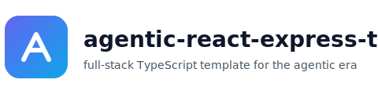
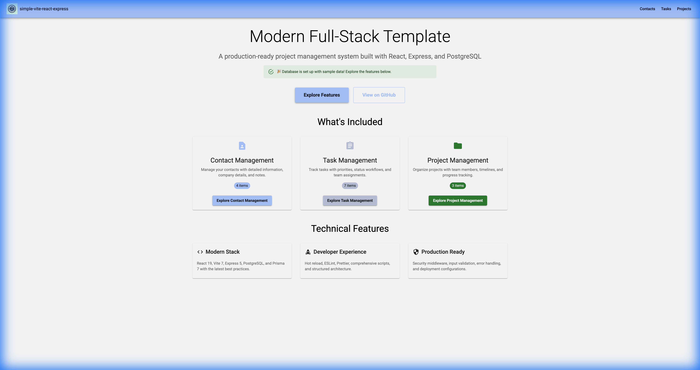
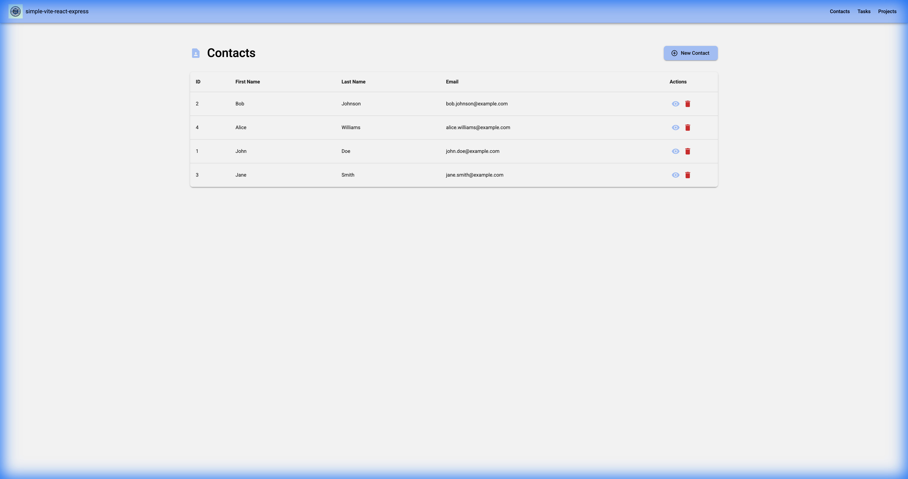
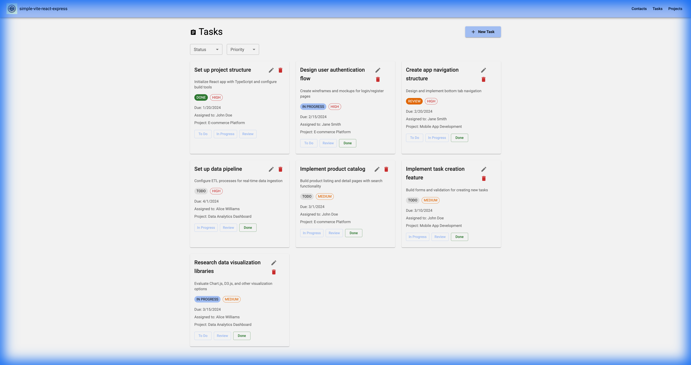
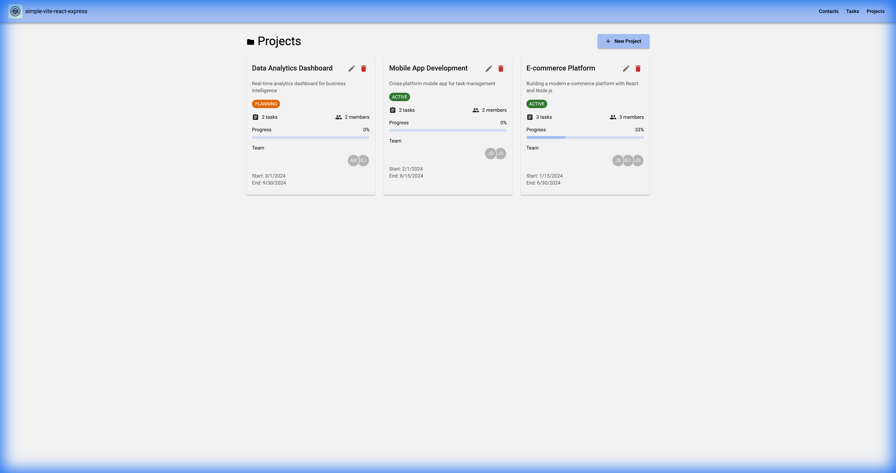

# agentic-react-express-ts

<p align="center">
  
</p>

<p align="center">
  
  
  
  
  
  
  
  
</p>

<p align="center"><strong>A production-ready full-stack TypeScript template for the agentic era.</strong></p>

This is the spiritual successor to [`simple-vite-react-express`](https://github.com/Avinava/simple-vite-react-express). Same proven stack, modernized for how people actually build in 2026 — with Claude Code, Copilot, Codex, and Gemini sitting in your editor.

The template is **agent-native**: types flow end-to-end so generated code can be type-checked, every commit runs guardrails so bad code gets rejected in seconds, and common workflows live as skill files your agent reads step-by-step.

Inspired by [`agentic-guardrail-ts`](https://github.com/Avinava/agentic-guardrail-ts) — same "drop-in for your AI coding agent" UX, but as a full application template rather than a guardrail kit.

---

## Why this template

- **Type-safe end-to-end.** tRPC carries types from server to client. Edit a router, the client auto-typechecks. Zero schema drift.
- **Guardrails in every commit.** Lefthook runs ESLint, TypeScript, Knip, Vitest, Gitleaks, and Commitlint in parallel (~3s). Bad code gets rejected before it lands. See [skills/self-correcting-loop](skills/self-correcting-loop/SKILL.md).
- **Skill files your agent reads.** `skills/<name>/SKILL.md` give your AI step-by-step recipes for the operations that matter: adding a resource, stripping the demo, deploying safely.
- **Working demo, not empty files.** A real CRM with contacts/tasks/projects you can run in minutes.

---

## Quick start

**Prerequisites:** Node 22+, PostgreSQL running locally.

```bash
# Start a new project from this template (no git history)
npx degit Avinava/agentic-react-express-ts my-project
cd my-project

# Or clone if you want history
git clone git@github.com:Avinava/agentic-react-express-ts.git my-project
cd my-project

# Install & set up
npm install
cp example.env .env       # edit DATABASE_URL
npm run setup
npm run db:setup
npm run db:seed

# Run
npm run dev
```

Open <http://localhost:3000>.

---

## For agents

Point your coding agent at the project. It will pick up [`AGENTS.md`](AGENTS.md) (the canonical guide), or the agent-specific pointer files: [`CLAUDE.md`](CLAUDE.md), [`GEMINI.md`](GEMINI.md), or [`.github/copilot-instructions.md`](.github/copilot-instructions.md).

When the agent hits a task with a matching skill, it should read that skill first:

| Task                                  | Read                                                                  |
| ------------------------------------- | --------------------------------------------------------------------- |
| First time opening the repo           | [`skills/onboard-an-agent`](skills/onboard-an-agent/SKILL.md)         |
| Adding a new full-stack resource      | [`skills/add-resource`](skills/add-resource/SKILL.md)                 |
| Commit got rejected                   | [`skills/self-correcting-loop`](skills/self-correcting-loop/SKILL.md) |
| Stripping the demo for a real project | [`skills/remove-demo-code`](skills/remove-demo-code/SKILL.md)         |
| About to deploy                       | [`skills/deploy-checklist`](skills/deploy-checklist/SKILL.md)         |

---

## Stack

| Layer        | Tool                                                |
| ------------ | --------------------------------------------------- |
| Language     | TypeScript 5 (`strict`, `noUncheckedIndexedAccess`) |
| Client       | React 19 + Vite 7 + MUI 7 + React Router 7          |
| Server       | Express 5 + tRPC 11                                 |
| Data         | Prisma 7 + PostgreSQL                               |
| Validation   | Zod (shared between client and server)              |
| Forms        | React Hook Form + Zod resolver                      |
| Server state | TanStack Query                                      |
| Tests        | Vitest 4 + React Testing Library                    |

---

## Project structure

```
.
├── .github/
│   ├── workflows/ci.yml           # lint + typecheck + knip + test + build
│   └── copilot-instructions.md    # Copilot pointer
├── prisma/
│   ├── schema.prisma              # CRM schema (Contact, Task, Project)
│   └── seed.ts                    # demo data
├── public/logo.svg
├── screenshots/                   # README screenshots
├── scripts/
│   ├── setup.ts                   # interactive setup
│   └── typecheck-staged.sh
├── skills/                        # agent-readable workflows
│   ├── onboard-an-agent/SKILL.md
│   ├── add-resource/SKILL.md
│   ├── self-correcting-loop/SKILL.md
│   ├── remove-demo-code/SKILL.md
│   └── deploy-checklist/SKILL.md
├── src/
│   ├── client/                    # React app
│   ├── server/                    # Express + tRPC
│   └── shared/                    # Zod schemas (both sides)
├── AGENTS.md  CLAUDE.md  GEMINI.md
├── eslint.config.js  lefthook.yml  commitlint.config.ts  knip.json
├── tsconfig.json  tsconfig.server.json
├── vite.config.ts  vitest.config.ts
└── package.json
```

**Boundary rules** (enforced by ESLint):

- `src/server/**` ↮ `src/client/**` (no value imports across the line)
- `src/shared/**` is the safe shared zone
- Client may `import type` from server for the tRPC `AppRouter` only

---

## Guardrails — the self-correcting commit loop

Every `git commit` triggers:

```
Agent generates code
    ↓
git commit → Lefthook runs checks in parallel (~3s)
    ↓
┌─ Prettier ────── auto-fixes formatting               ✓
├─ Knip ────────── detects unused export                ✗
├─ ESLint ──────── catches import from wrong tier       ✗
├─ TypeScript ──── finds type error                     ✗
├─ Vitest ──────── runs related tests                   ✓
├─ Gitleaks ────── scans for secrets                    ✓
└─ Commitlint ──── validates commit message             ✓
    ↓
Commit REJECTED — agent reads errors, fixes, retries
    ↓
All checks pass → CI runs full pipeline → merge ✓
```

**The key insight:** AI coding agents respect git hooks. When a commit fails, the agent sees the errors, fixes them, and retries — no human intervention. See [skills/self-correcting-loop](skills/self-correcting-loop/SKILL.md) for the full read-errors-fix-retry workflow.

**NEVER `--no-verify`.** If hooks fail, the code is wrong, not the hooks.

---

## Scripts

| Script                                                      | What it does                                |
| ----------------------------------------------------------- | ------------------------------------------- |
| `npm run dev`                                               | Client (:3000) + server (:3001) in parallel |
| `npm run build`                                             | Build client (Vite) and server (tsc)        |
| `npm run start`                                             | Run the production server                   |
| `npm run typecheck`                                         | TypeScript check for client + server        |
| `npm run lint` / `lint:fix`                                 | ESLint                                      |
| `npm run lint:unused`                                       | Knip — unused exports/deps                  |
| `npm run format` / `format:check`                           | Prettier                                    |
| `npm run test` / `test:run` / `test:coverage`               | Vitest                                      |
| `npm run db:setup`                                          | `prisma migrate dev` + `prisma generate`    |
| `npm run db:migrate` / `db:seed` / `db:studio` / `db:reset` | Prisma                                      |

---

## Demo

The template ships with a working CRM: contacts, tasks, and projects with relationships.

<p align="center">
  
  <br><em>Homepage</em>
</p>

<p align="center">
  
  <br><em>Contacts</em>
</p>

<p align="center">
  
  <br><em>Tasks</em>
</p>

<p align="center">
  
  <br><em>Projects</em>
</p>

When you're ready to build something real, read [skills/remove-demo-code](skills/remove-demo-code/SKILL.md).

---

## Customization

- **Branding** — replace `public/logo.svg` and update the title in `index.html`.
- **Theme** — edit `src/client/theme/theme.ts` (MUI palette).
- **Domain** — see [skills/remove-demo-code](skills/remove-demo-code/SKILL.md) to strip the CRM, then [skills/add-resource](skills/add-resource/SKILL.md) for each new resource.
- **DB** — swap Postgres for another Prisma-supported DB by editing `prisma/schema.prisma`'s `datasource` and the `DATABASE_URL`.

---

## Deploy

Any platform that runs Node + Postgres works. Recommended:

- **Railway** — one-click Postgres + Node, deploy on push.
- **Fly.io** — `fly launch` autodetects the Node app; provision Postgres separately.
- **Render** — same shape as Railway.

Before deploying, run [skills/deploy-checklist](skills/deploy-checklist/SKILL.md).

---

## Contributing

See [CONTRIBUTING.md](CONTRIBUTING.md).

---

## Credits

- Builds on [`simple-vite-react-express`](https://github.com/Avinava/simple-vite-react-express) — same author, this is the modernized successor.
- Guardrail patterns inspired by [`agentic-guardrail-ts`](https://github.com/Avinava/agentic-guardrail-ts).

---

## License

[MIT](LICENSE)
